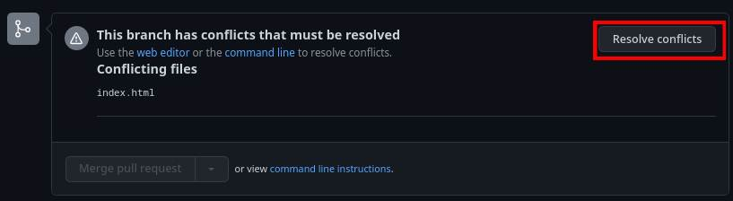

<div id="top"></div>
<h1 align="center">Gitflow</h1>
<p align="center">Resumen del taller de Git y Github</p>

<details>
  <summary>Contenidos</summary>
  <ol>
    <li>
      <a href="#branches">Todas las ramas</a>
    </li>
    <li>
        <a href="#primeros-usos">Primeros usos</a>
    </li>
    <li>
      <span>Ramas especiales</span>
      <ul>
        <li><a href="#ramas-feature">Rama Feature</a></li>
        <li><a href="#ramas-hotfix">Rama Hotfix</a></li>
        <li><a href="#ramas-release">Rama Release</a></li>
      </ul>
    </li>
    <li><a href="#pull-request">Pull Request</a></li>
    <li><a href="#issues">Issues</a></li>
    <li><a href="#git-conflicts">Conflictos de Git</a></li>
    <li><a href="#tags">Etiquetas</a></li>
  </ol>
</details>

<br />

# Branches
* `Main` Contiene las versiones finales
* `Develop` Tiene la versión más actualizada del software
* `Feature` Crea una funcionalidad específica
* `Release` Crea la documentación para una versión del software
* `Hotfix` Sirve para arreglar errores que surgen en una versión final 

Main y Develop no tienen ningún commit, solo merge, osea, no se trabaja en ellas directamente

Una rama `release` y `hotfix` realiza 2 pull request, una hacia Main y otra hacia Develop

<p align="right">(<a href="#top">back to top</a>)</p>

# Primeros usos

1. Inicializar un repositorio
```
git init
git remote add origin <git-clone-url>
```

2. Para evitar bugs, crear un documento y hacer commit
```
echo "# title" >> README.md
git add README.md
git commit -m ":tada: Initial Commit"
git branch -M main
git push -u origin main
```

3. Crear una rama `develop`
```
git checkout -b develop
```

4. Publicar la rama 
```
git push origin develop
```

Sobre la rama `develop` no se trabaja directamente, se crean nuevas ramas con el prefijo `feature_` o `f_`, estas sirven para agregar características, y luego de trabajar con ellas, se hace un pull request hacia `develop`


<br />

Uso de un commit detallado
```
git commit -m "commit-message" -m "commit-description"
```

<p align="right">(<a href="#top">back to top</a>)</p>

# Ramas `feature`
Para agregar una característica  al proyecto se crea una rama desde *develop* con el prefijo `feature_` o `f_`

1. Actualizar rama develop y crear la rama
```
git checkout develop
git pull origin develop
git checkout -b feature_<name>
```

2. Agregar código necesario

3. Comitear en las rama feature
```
git add .
git commit -m "commit_message" -m "commit_description"
git push origin feature_<name>
```

4. Crear un pull request para unir la rama feature con develop o seguir creando nuevas características y luego realizar el pull request

    ___Antes debe estar todo comiteado y pusheado___

<p align="right">(<a href="#top">back to top</a>)</p>

# Ramas `hotfix`
Para arreglar un pequeño error en una versión final se crea una rama desde *main* con el prefijo `hotfix_`

1. Actualizar rama main y crear la rama
```
git checkout main
git pull origin main
git checkout -b hotfix_<name>
```

2. Agregar código necesario

3. Comitear en la rama hotfix
```
git add .
git commit -m "commit_message" -m "commit_description"
git push origin hotfix_<name>
```

4. Crear un 2 pull request para unir la rama hotfix con main y con develop

<a href="#pull-request">Mas info sobre Pull Request</a>

___Antes debe estar todo comiteado y pusheado___

<p align="right">(<a href="#top">back to top</a>)</p>

# Ramas `release`
Contiene la documentación de una versión final del software `release_`

1. Actualizar rama develop y crear la rama
```
git checkout develop
git pull origin develop
git checkout -b release_<name>
```

2. Agregar documentación necesaria

3. Comitear en la rama release
```
git add .
git commit -m "commit_message" -m "commit_description"
git push origin release_<name>
```

4. Crear un 2 pull request para unir la rama release con main y con develop

<a href="#pull-request">Mas info sobre Pull Request</a>

<p align="right">(<a href="#top">back to top</a>)</p>

# Pull Request

1. Dirigirse a pestaña de pull request y crear un pull request


2. Verificar que la rama base sea la correcta (rama a la que se hará merge)


> Para una característica el pull request es:
> * develop <- feature_name

> Para una nueva versión los pull request son: 
> * main <- release_name
> * develop <- release_name

> Para un hotfix los pull request son:
> * main <- hotfix_name
> * develop <- hotfix_name

3. Agregar un título, descripción y etiqueta (opcional)


La persona encargada deberá ir al pull request en la pestaña "pull requests" y darle click 


Ver si no existen conflictos y realizar el merge dando click al botón


Dejar los mensajes del merge tal cual, o modificarlos y confirmar


__OJO__ Luego de realizar correctamente las pull request de un `release` o de una rama `hotfix` se actualizan las demás ramas

```
git checkout main
git pull origin main
git checkout develop
git pull origin develop
```

Si es una rama `feature` solo se actualiza la rama `develop`
```
git checkout develop
git pull origin develop
```


<p align="right">(<a href="#top">back to top</a>)</p>

# Issues

1. Ir a pestaña de Issues

2. Dar click al boton "new issue"


3. Rellenar el formulario con el título, descripción de la nueva característica o del bug encontrado

    3.1 Agregar un label al la petición

4. Confirmar dando click al botón "Submit new issue"


5. Esperar que alguien se encargue de resolver el nuevo Issue


<p align="right">(<a href="#top">back to top</a>)</p>

# Git Conflicts

Surge cuando 2 ramas diferentes tienen cambios en las mismas líneas y se quiere hacer merge a una rama base común

Al crear un pull request aparece


Al intentar hacer merge


1. Dar click a "Resolve conflicts"



- Parte izquierda aparecen los archivos que generan conflicto
- Parte derecha aparece el código sin resolver


2. Decidir qué código preservar y eliminar las líneas


3. Marcar como resuelto y repetir para los demás archivos


4. Luego de resolver los archivos, confirmar


5. Ahora se podrá realizar el merge correctamente


<p align="right">(<a href="#top">back to top</a>)</p>

# Tags

1. Cambiar la rama main para establecer una etiqueta de la versión
```
git checkout -b main
```

2. Agregar etiqueta
```
git tag -m v1.0.0 -m "tag-description"
```

3. Publicar etiqueta
```
git push origin --tags
```

<p align="right">(<a href="#top">back to top</a>)</p>
